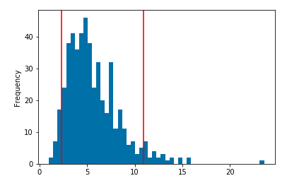

# Financial Report

## Budget Analysis

This analysis is based on 90 days of transcation data and income information 
from "ins_109508" imported from Plaid's API.

## Retirement Planning

To evaluate the viability of this retirement portfolio, we ran Monte Carlo 
simulation consisting of 500 simulations to project 30 years of potential 
return outcomes.  Projected rates of return were based on the mean and standard
deviations of daily returns for both stock and bond portions of the portfolio.

